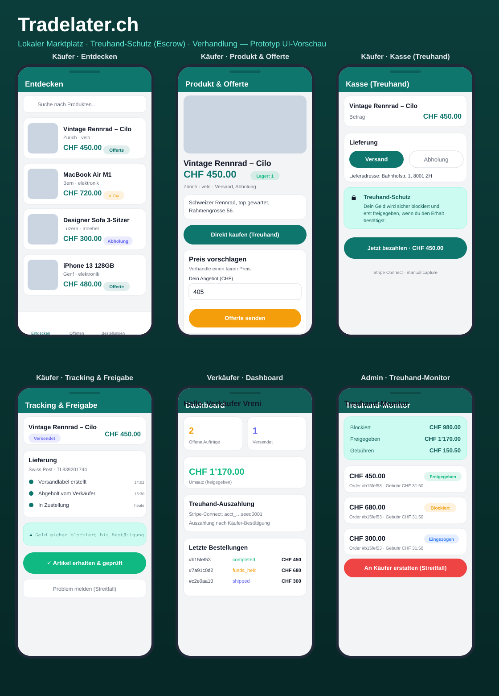

# Tradelater.ch – UI-Vorschau



Diese Vorschau zeigt die wichtigsten Screens des Prototyps, **ohne** dass du die
App starten musst:

- **Käufer:** Entdecken · Produktdetail + Offerte · Kasse (Treuhand) · Tracking & Freigabe
- **Verkäufer:** Dashboard mit Treuhand-Auszahlung
- **Admin:** Treuhand-Monitor (blockiert / freigegeben / Gebühren)

> Es ist eine designgetreue Darstellung der echten Screens unter
> `frontend/src/screens/`. Das Bild lässt sich neu erzeugen mit:
>
> ```bash
> cd preview && npm i @resvg/resvg-js && node generate-preview.js
> ```

## Die echte App starten (interaktiv)

Die App ist React Native / Expo – du kannst sie auf dem Handy (Expo Go),
im iOS/Android-Simulator oder im Browser ansehen:

```bash
# 1) Backend (läuft ohne Keys im Mock-Modus, mit Demo-Daten)
cd backend && npm install && npm run dev

# 2) Frontend (in neuem Terminal)
cd frontend && cp .env.example .env && npm install
npm start            # dann "w" für Web, oder QR-Code mit Expo Go scannen
```

**Demo-Logins** (Knöpfe direkt auf dem Login-Screen):

| Rolle      | E-Mail                       | Passwort   |
|------------|------------------------------|------------|
| Käufer     | kaeufer@tradelater.ch        | buyer123   |
| Verkäufer  | verkaeufer@tradelater.ch     | seller123  |
| Admin      | admin@tradelater.ch          | admin123   |
